# Message Graph

```mermaid
graph TD
    %% Message nodes
    SystemMsg["📋 System Message<br/>Role: System<br/>Content: Messages are nodes in a graph"]
    UserMsg["👤 User Message<br/>Role: User<br/>Content: But messages aren't the only thing in the graph"]
    subgraph PrevMessages["Previous Messages"]
        PrevSystemMsg["📋 System Message<br/>Role: System<br/>Content: Edits are kept in the graph as context"]
        PrevUserMsg["👤 User Message<br/>Role: User<br/>Content: So we can ensure they're immutable while keeping them editable"]
    end
    
    %% Chat Response as a subgraph
    subgraph ChatResponseBox["💬 Chat Response"]
        ChatMetadata["📊 Metadata<br/>Temp: 1.0<br/>..."]
        ChatResponseText["📝 Response<br/>Hello, Here's a subagent call: &lt;tool&gt;subagent&lt;/tool&gt;"]
        ChatContent["Content: Hello, Here's a subagent call..."]
    end
    
    %% Tool Response as a subgraph
    subgraph ToolResponseBox["🔧 Tool Response"]
        subgraph ToolMetadata["📊 Tool Metadata"]
            ToolMetadataLength["Length: 3"]
            subgraph ToolChat["💭 Subagent Chat"]
                SubagentSystem["📋 System<br/>Content: Subagent call received"]
                SubagentUser["👤 User<br/>Content: Process this request"]
                SubagentAssistant["🤖 Assistant<br/>Content: Processing..."]
                SubagentSystem --> SubagentUser
                SubagentUser --> SubagentAssistant
            end
        end
        ToolContent["Content: Subagent call output"]
    end
    
    %% Graph flow connections
    SystemMsg --> UserMsg
    PrevSystemMsg --> PrevUserMsg
    PrevMessages -.-> UserMsg
    UserMsg --> ChatResponseBox
    ChatResponseBox --> ToolResponseBox
    
    class SystemMsg,UserMsg messageNode
    class ChatResponseBox responseNode
    class ToolResponseBox responseNode
    class ChatMetadata,ChatResponseText,ChatContent,ToolMetadata,ToolChat,ToolContent,ToolMetadataLength metadataNode
```



Messages should be a graph (DAG, specifically) of immutable elements.

## Why immutable elements?
We want to train on policy
- This means the context cannot change after we call a response.

## Why a graph?
Nodes and connections are a natural way to represent the flow of information in an agent conversation.

## Will this be annoying to deal with?

It shouldn't be! While there will be internal stuff that may look ???, for the interface, it should be as simple as your
normal context window edits, so `message_history[2]['content'] = my_edit`, but internally we'll deal with the recordkeeping
and how this ends up parsing into on policy training data, if requested.

## Edges

Edges are the connections between nodes, and there are two types we are concerned with:
- **Sequential edges**: These represent the flow of conversation, connecting messages in the order they were sent. For example, a user message followed by an assistant response.
- **Parallel edges**: These represent versioning, e.g. edit history, context squishing, etc.
We, however, are only concerned about parallel edges when we break the prefix, and ignore any other parallel edges.

## So what does this look like in practice?

```python
import copy


class MessageGraph:
    def __init__(self):
        self.messages = []
        self.prev_graph = None

    def append(self, message):
        self.messages.append(message)

    def __getitem__(self, index):
        return self.messages[index]

    def __setitem__(self, key, value):
        # check if an assistant message is after this indx
        needs_new_graph = False
        first_idx = -1
        for i in range(key, len(self.messages)):
            if (i == key) and (value['role'] == 'assistant') and (value['content'] == self.messages[i]['content']):
                # no op
                return
            needs_new_graph = needs_new_graph or (self.messages[i]['role'] == 'assistant')
            if needs_new_graph and first_idx == -1:
                first_idx = i
        if needs_new_graph:
            self.prev_graph = copy.deepcopy(self)
        self.messages[key] = value

    def __len__(self):
        return len(self.messages)

    def __eq__(self, other):
        return "\n\n".join(f"{msg['role']}: {msg['content']}" for msg in self) == "\n\n".join(
            f"{msg['role']}: {msg['content']}" for msg in other)


# in use
messages = MessageGraph()
messages.append({'role': 'system', 'content': 'Hello, I am a system message'})
messages[0] = {'role': 'user', 'content': 'Hello, I am a user message'}
```